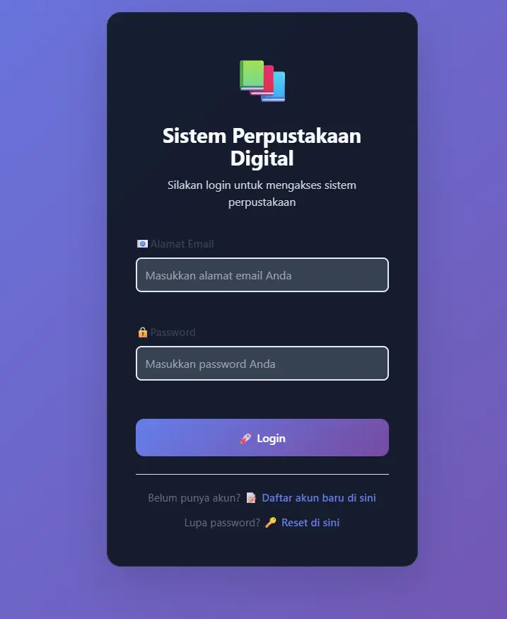

# Sistem Informasi Manajamen Perpustakaan (SIMAPAN)

Sistem untuk mengatur dan memanajemen buku-buku di Perpustakaan




## Fitur

- SIstem login untuk user/admin
- Manajemen buku lewat akun admin
- Peminjaman buku


## Dependencies (PENTING)
Untuk menjalankan SIMAPAN yang berbasis AdonisJS, dibutuhkan versi Node.js versi 20 keatas. 

[VSCode](https://code.visualstudio.com/download) atau sejenisnya

[Git](https://git-scm.com/install/) (digunakan untuk clone)

[Postman](https://www.postman.com/downloads/) (digunakan untuk daftar akun admin)

[Node.js](https://nodejs.org/en)

[XAMPP](https://www.apachefriends.org/index.html) atau [Laragon](https://laragon.org/download) atau sejenisnya untuk database


## Instalasi


Clone project SIMAPAN

```bash
git clone https://github.com/wanda211/TUBES-RPL
```

Pergi ke folder projectnya. Contoh nama project (`simapan`)

```bash
cd simapan
```

Salin file `.env.example` menjadi `.env` untuk digunakan sebagai enviorement

```bash
copy .env.exmaple .env
```
Sesuaikan file `.env` dengan informasi database anda.

Install dependencies

```bash
npm install
```

Generate Key App

```bash
node ace generate:key
```

Migrate Database
```bash
node ace migration:run
```

Start backend server

```bash
node ace serve --watch
```

> [!IMPORTANT]
>
> Untuk menjalankan frontend servernya (Tampilan web) dibutuhkan 2 terminal profile untuk menjalankan backend dan juga frontend server.

Lakukan ini pada profile terminal yang baru:

Masuk directory frontend

```bash
cd frontend-perpustakaan
```

Install dependencies yang diperlukan

```bash
npm install vite
```

Jalankan frontend server

```bash
npm run dev
```

## Pembuatan Akun Admin
> [!NOTE]
>
> Terdapat dua metode untuk membuat akun admin, ini bisa dilakukan lewat database ataupun lewat [Postman](https://www.postman.com/downloads/). Untuk efisiensi waktu, kami merekomendasikan penggunaan [Postman](https://www.postman.com/downloads/).

Isi permintaan POST dengan menggunakan URL
```bash
 http://localhost:3333/register
```
Isi data body dengan mencentang `raw`. Contoh format pembuatan akun admin:
```javascript
{
  "fullName": "Administrator System",
  "email": "admin@perpus.com",
  "password": "Admin123!",
  "password_confirmation": "Admin123!",
  "role": "admin"
}
```
Lalu lakukan permintaan. Jika respons menjawab dengan mengirim data `"user"` dengan `token`, maka akun berhasil dibuat.

## Known Issues (Kekurangan)

- Fitur reset password
- Data seeder tidak ada sehingga pembuatan akun admin harus dilakukan secara manual
